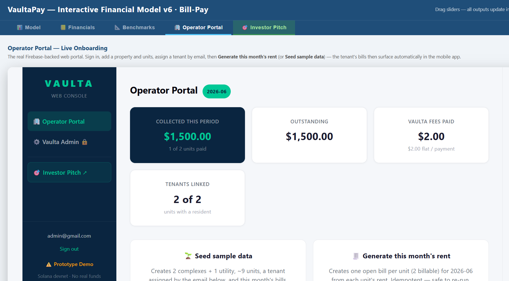
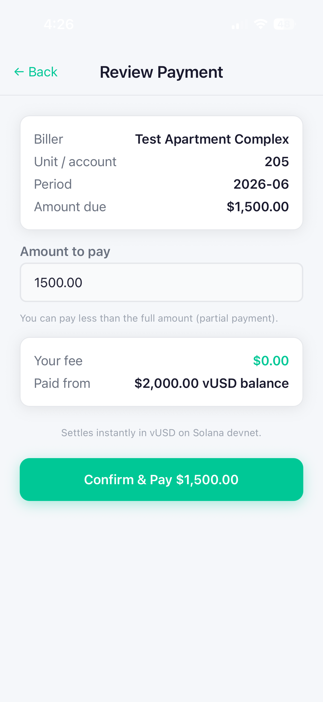
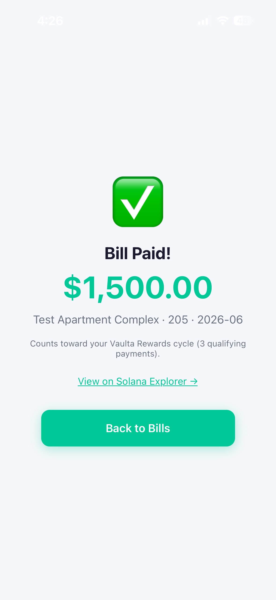
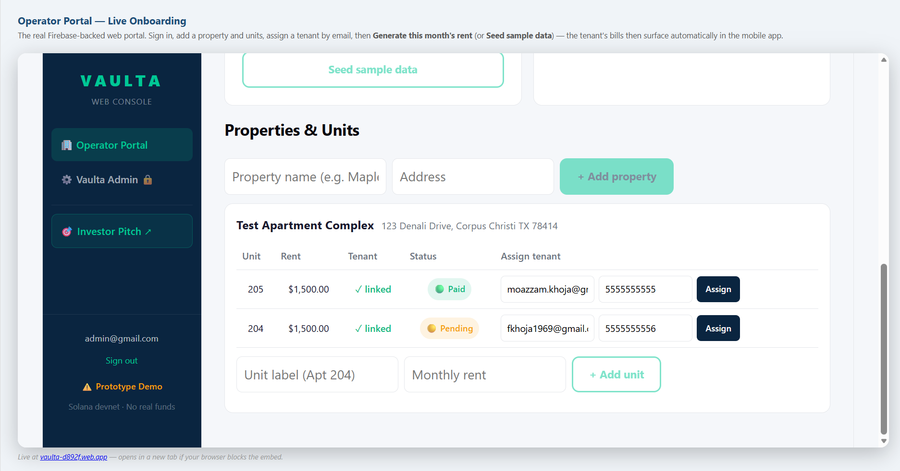

# Pitch-Deck Update — Add the Live Bill-Pay Demo Proof

**Goal of the next session:** update the investor pitch deck (`pitch-embed.html`, shown in the
**🎯 Investor Pitch** tab) so it reflects what is now **live and proven** — and embed real
screenshots of the working bill-pay product. Right now the deck's traction slide still describes
the *old debit / two-phone* prototype, which has been replaced.

> **Strict wording rule (whole repo):** never "yield / interest / APY" → always **"Vaulta Rewards"**,
> **"T-bill float"**, **"estimated reward"**. The captions below already follow this.

---

## 0. Context — what changed (the app is now live)

The separate app repo (`C:\Projects\Vaulta`, project `vaulta-d892f`) was deployed and demoed
**end-to-end on live infra** on 2026-06-18:

- **iOS Build 9** on TestFlight — the **bill-pay** app (NOT the old QR/two-phone debit app).
- **12 Cloud Functions** live on Firebase + Firestore **rules & indexes** deployed.
- **Operator web portal** hosted at **https://vaulta-d892f.web.app**, embedded as the **🏢 Operator
  Portal** tab in this very site (`index.html`).
- **~292 automated tests** pass (271 mobile Jest + 21 web Vitest); functions `tsc` clean.
- **Proven loop:** operator onboards tenants by email → renter signs up + KYC on the phone → the
  bill auto-surfaces → renter pays one-tap → settles in **vUSD on Solana devnet** → the operator
  portal flips to **Paid**.

The old model that the deck still references — *"two-phone live payment, consumer signs on own
device"* (a QR point-of-sale flow) — was **removed entirely**. Do not keep that wording.

---

## 1. Save the screenshots into this repo first (manual step)

The four demo screenshots are attached to the chat that produced this doc. Save them into
`C:\Projects\Vaulta-Pay-Model\` with **exactly these filenames** (the deck and this doc reference
them):

| Filename | Orientation | What it shows |
|---|---|---|
| `demo-pay-review.png` | tall (phone) | Mobile **Review Payment** — Test Apartment Complex, Unit 205, $1,500 due, **Your fee $0.00**, paid from $2,000 vUSD balance, "Settles instantly in vUSD on Solana devnet." |
| `demo-bill-paid.png` | tall (phone) | Mobile **Bill Paid!** — $1,500, "Test Apartment Complex · 205 · 2026-06", **View on Solana Explorer →**, counts toward Vaulta Rewards cycle. |
| `demo-operator-dashboard.png` | wide (web) | **Operator Portal** rollup cards — COLLECTED $1,500 (**1 of 2 units paid**), OUTSTANDING $1,500, **VAULTA FEES PAID $2.00**, **TENANTS LINKED 2 of 2**. |
| `demo-portal-status.png` | wide (web) | Operator unit rows — Unit **205 ✓ linked · Paid**, Unit **204 ✓ linked · Pending** (the per-unit "who's paid" view). |

Preview (renders once the files are saved):






---

## 2. Fix the stale traction slide (`#s13`, "Built and proven")

In `pitch-embed.html`, find `<div class="slide" id="s13">` (label "Traction & Seed Plan"). Its
**"Where We Are Today"** checklist (`<div class="curr-state">`) is factually out of date. Replace
the `cs-item` rows with the current reality:

**Remove / replace these lines:**
- ❌ `iOS app live on TestFlight (Build 8) — full end-to-end payment flow`
- ❌ `Two-phone live payment: consumer signs on own device, vUSD transferred on-chain` *(this flow was deleted)*
- ❌ `172 automated tests passing; Firestore security rules deployed`
- ❌ `6 Cloud Functions live on Firebase; Solana SPL token in production`

**Use these instead** (keep the existing `<div class="cs-item"><div class="ck">✅</div><div>…</div></div>` markup):
- ✅ `iOS Build 9 live on TestFlight — full bill-pay flow (rent + utilities)`
- ✅ `Operator web portal live (vaulta-d892f.web.app) — onboard tenants by email, issue bills`
- ✅ `Renter bills auto-surface in-app and settle one-tap in vUSD on Solana devnet`
- ✅ `Consumer KYC + Merchant KYB; on-chain merchant withdrawal (burns vUSD, settles to bank)`
- ✅ `Vaulta Rewards cycle engine (90-day) deployed and tested`
- ✅ `~292 automated tests passing (271 mobile + 21 web); Firestore rules + indexes deployed`
- ✅ `12 Cloud Functions live on Firebase; Solana SPL token (vUSD) in production`
- ✅ `End-to-end proven on live infra — operator onboards → renter pays → portal shows Paid`

*(Leave the right-hand "$2.1M Seed — Milestones to Series A" column as-is unless the numbers changed.)*

---

## 3. Add a new "Live Demo" proof slide (after `#s13`, before `#s14`)

The deck auto-counts slides (`const slides = document.querySelectorAll('.slide'); const total =
slides.length;`), so **adding a slide needs no counter changes** — just drop it in the right place.

Insert this block **between** the closing `</div>` of slide `#s13` and the start of slide `#s14`
("THE ASK"). It reuses the existing `.hiw-flow / .hiw-step / .hiw-phone` image-grid styles already
used on the Renter/Operator experience slides (`#s5`/`#s6`):

```html
<!-- ══ SLIDE 13b: LIVE DEMO PROOF ══ -->
<div class="slide" id="s13b">
  <div class="slide-inner">
    <div class="slide-label">Proof · Live Demo</div>
    <div class="slide-title">Live bill-pay demo —<br><em>real, on-chain, today</em></div>
    <div class="slide-body" style="flex-direction:column; gap:12px; justify-content:flex-start;">
      <div class="hiw-flow">
        <div class="hiw-step">
          <div class="hiw-phone"></div>
          <div class="step-num">1</div>
          <h4>Renter taps Pay</h4>
          <p>Unit 205 rent — $1,500 due, <strong>$0 renter fee</strong>, paid from vUSD. Settles instantly on Solana devnet.</p>
        </div>
        <div class="hiw-step">
          <div class="hiw-phone"></div>
          <div class="step-num">2</div>
          <h4>Settles on-chain</h4>
          <p>Instant vUSD settlement with a Solana Explorer receipt; counts toward the renter's Vaulta Rewards cycle.</p>
        </div>
        <div class="hiw-step" style="flex:1.6;">
          <!-- wide web screenshot: override the tall phone aspect -->
          <div class="hiw-phone" style="aspect-ratio:auto; height:auto; padding:6px;">
            
          </div>
          <div class="step-num">3</div>
          <h4>Operator sees it land</h4>
          <p>$1,500 collected · 1 of 2 units paid · $2 Vaulta fee · 2 of 2 tenants linked — live in the operator portal.</p>
        </div>
      </div>
    </div>
  </div>
</div>
```

**CSS note:** `.hiw-phone` is sized for tall phone screenshots, so the wide
`demo-operator-dashboard.png` gets an inline override above. If it still looks cramped, either give
that third `.hiw-step` its own full-width row below the two phones, or add a small rule like
`#s13b .hiw-phone img { object-fit: contain; }`. Use `demo-portal-status.png` as an alternate/extra
if you want the per-unit "who's paid" view instead of (or beside) the rollup cards.

---

## 4. Also worth refreshing (optional, same session)

- **Slide `#s6` "Operator experience"** still shows the old merchant *accept-payment* mockups
  (`screen-m-accept.png` etc.). Now that the operator experience is a **web portal + read-only phone
  dashboard**, consider swapping in `demo-operator-dashboard.png` / `demo-portal-status.png`.
- **Slide `#s5` "Renter experience"** step 2 says "Deposit via ACH **or cash at a partner
  location**." Cash-in was removed — make it **ACH / bank only**.
- **Benchmarks tab** (`index.html`) — still the old narrative per the repo's main next-session
  prompt; out of scope here but flagged.

---

## 5. Commit & deploy (GitHub Pages)

This repo serves GitHub Pages from `main` (root). After saving the images + editing the deck:

```bash
cd C:\Projects\Vaulta-Pay-Model
git add demo-pay-review.png demo-bill-paid.png demo-operator-dashboard.png demo-portal-status.png pitch-embed.html
git commit -m "Pitch: refresh traction slide + add live bill-pay demo proof slide"
git push                # GitHub Pages redeploys from main
```

**Verify:** open https://moazzamkhoja.github.io/Vaulta-Pay-Model/ → **🎯 Investor Pitch** tab →
arrow to the traction + new Live Demo slides; confirm the four images load and the counts read
correctly. (Pages CDN can take 1–2 min; hard-refresh.)

---

## 6. Quick-reference facts (so you don't re-derive them)

| Item | Value |
|---|---|
| Firebase project | `vaulta-d892f` |
| Operator portal URL | https://vaulta-d892f.web.app (embedded as the 🏢 Operator Portal tab) |
| iOS build | **Build 9** on TestFlight (bill-pay app) |
| Cloud Functions | **12** live |
| Tests | **271 mobile Jest + 21 web Vitest ≈ 292** |
| Demo data | Test Apartment Complex · Unit 205 **Paid** $1,500 / Unit 204 **Pending** · $2 flat Vaulta fee · 2 of 2 tenants linked |
| App repo (do NOT edit from here) | `C:\Projects\Vaulta` (branch `billpay`) |
